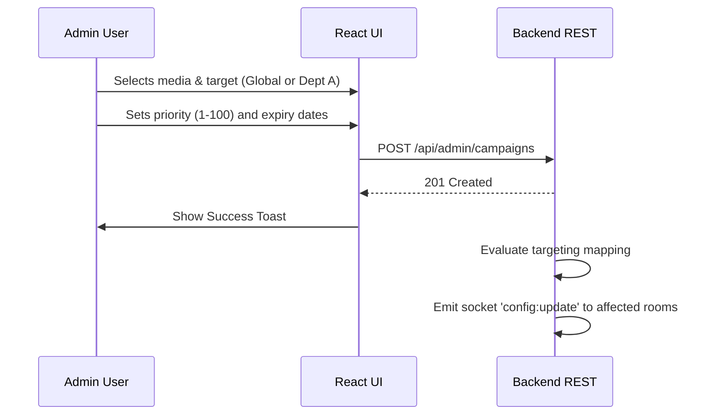
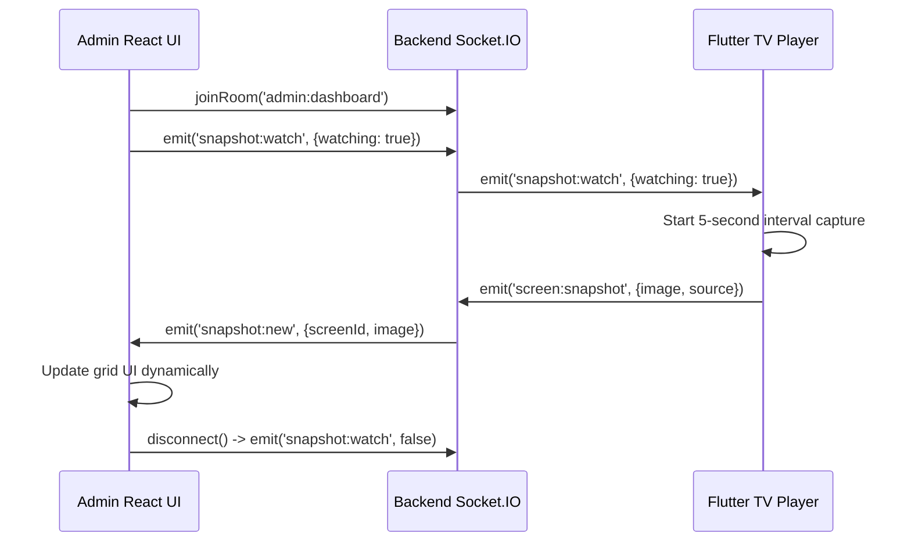

# Admin Website Flow & Architecture

## Purpose & Responsibilities
The Admin Website is a Single Page Application (SPA) providing a comprehensive dashboard for hospital IT administrators and marketing teams. Its responsibilities include:
- Managing departments and pairing new TV screens.
- Uploading and organizing media (images, videos) into playlists.
- Creating targeted or global campaigns with priority-based scheduling.
- Emitting real-time emergency broadcasts and live health alerts.
- Monitoring real-time device health, current content, and viewing live snapshots of the TV displays over WebSockets.

## Tech Stack & Folder Tree
**Stack:** React, TypeScript, Vite, TailwindCSS (for utility styling mixed with vanilla CSS variables), Lucide Icons, Socket.IO Client.

```text
Admin_Website/
├── src/
│   ├── components/            # Reusable UI elements (Modals, Forms, Buttons, Loaders)
│   ├── pages/                 # Full view routes
│   │   ├── Dashboard.tsx      # Overview, stats, and real-time screen health
│   │   ├── DevicePairing.tsx  # Workflow for authorizing 6-digit TV pins
│   │   ├── ScreenManager.tsx  # List of screens, manual sync/power controls
│   │   ├── MediaLibrary.tsx   # File uploads, SHA-256 integrity display
│   │   ├── Campaigns.tsx      # Campaign creation, scheduling logic
│   │   ├── LiveFeeds.tsx      # TV snapshot CCTV view over WebSockets
│   │   ├── Emergency.tsx      # Emergency broadcast trigger/dismissal
│   │   └── Settings.tsx       # System-wide configuration (kioskLock, etc.)
│   ├── services/              # API wrappers and WebSocket connections
│   │   ├── api.ts             # Axios interceptors, JWT handling
│   │   └── socket.ts          # socket.io-client setup (admin:dashboard room)
│   ├── App.tsx                # React Router setup, Auth context provider
│   ├── main.tsx               # DOM injection
│   ├── index.css              # Global styles, variables, dynamic animations
│   └── types.ts               # Shared TypeScript interfaces matching Backend
├── .env.example               # Template for environment variables
└── package.json               # Dependencies (react, axios, socket.io-client)
```

## Setup & Run

### Environment Variables
| Name | Required | Meaning | Example Value |
|------|----------|---------|---------------|
| `VITE_API_URL` | **Yes** | Backend REST/Socket URL | `http://localhost:5000` |

### Local Development
1. Clone the repo and `cd Admin_Website`.
2. `npm install`
3. Copy `.env.example` to `.env.development` and set `VITE_API_URL`.
4. Run `npm run dev`. The UI will be available at `http://localhost:5173`.

### Build & Deploy
- **Build**: `npm run build` compiles the TypeScript and bundles assets into `dist/`.
- **Deploy (Vercel/Netlify)**: Set `VITE_API_URL` in the deployment settings. Ensure rewrite rules are configured to point all routes to `index.html` (e.g. `vercel.json`).

## Working Flow Diagrams

### Auth & Navigation Flow
```mermaid
flowchart TD
    A[User visits URL] --> B{Has valid JWT?}
    B -- No --> C[Login Page]
    C -->|Authenticate| D[Save Token to localStorage]
    D --> E[Dashboard]
    B -- Yes --> E
    
    E --> F[Screens]
    E --> G[Media/Playlists]
    E --> H[Campaigns]
    E --> I[Emergency]
    E --> J[Live Feeds (Snapshots)]
    
    C -->|Logout| C
```

### Campaign Creation Flow


### Live Feeds & Snapshot Flow


## Page-by-Page Map

- **Dashboard:** Hits `GET /api/admin/stats` and listens to `screen:status` via sockets to update offline/online counters dynamically.
- **Device Pairing:** User enters a 6-digit code shown on the TV. UI hits `POST /api/admin/screens/pairing/confirm`. Emits over sockets to finalize pairing on the TV.
- **Screen Manager:** Lists all TVs. Shows `connection_status` (online/offline). Admin can trigger manual commands (e.g., `SYNC_MEDIA`, `TAKE_SNAPSHOT`) which hit `POST /api/admin/screens/<SCREEN_ID>/command`.
- **Emergency:** Allows takeover of all screens. Hits `POST /api/admin/emergency` with `{ title, message, severity, target_ids }`. Clears via `POST /api/admin/emergency/clear`.

## Error Handling & Security Notes
- **Authentication**: JWTs are stored in `localStorage`. `api.ts` attaches `Authorization: Bearer <token>` to every request using Axios interceptors. On `401 Unauthorized`, the interceptor forces a logout and redirect.
- **Form Validation**: Handled strictly via controlled inputs. Required fields block submission.
- **WebSockets**: The socket connection uses the same JWT. If the socket disconnects, `socket.io-client` handles exponential backoff reconnection automatically.

## Troubleshooting

| Symptom | Cause | Fix |
|---------|-------|-----|
| UI shows 'Network Error' constantly | `VITE_API_URL` is incorrect or backend is down. | Verify `.env` and ensure backend is running. |
| Live snapshot feeds remain blank | TVs are offline, or the backend didn't relay the `snapshot:watch` event. | Click "Take Snapshot" manually to force a capture, or verify TV network status. |
| Logout loops immediately upon login | The JWT token in `localStorage` is malformed or expired. | Clear browser cache/Application storage and log in again. |

## Manual QA Checklist (Admin UI)
- [ ] Log in with valid credentials. Verify Dashboard loads.
- [ ] Navigate to Device Pairing. Enter a fake code, verify "Invalid Code" error. Enter a real code displayed on a TV, verify success and screen appearing in Manager.
- [ ] Upload a valid image. Ensure it appears in the Media library grid.
- [ ] Create a Campaign targeting one specific department. Verify only screens in that department receive the `config:update` (check backend logs or TV).
- [ ] Trigger an Emergency broadcast with Siren enabled. Verify TV immediately overlays the red screen. Click "Clear Emergency" and verify recovery.
