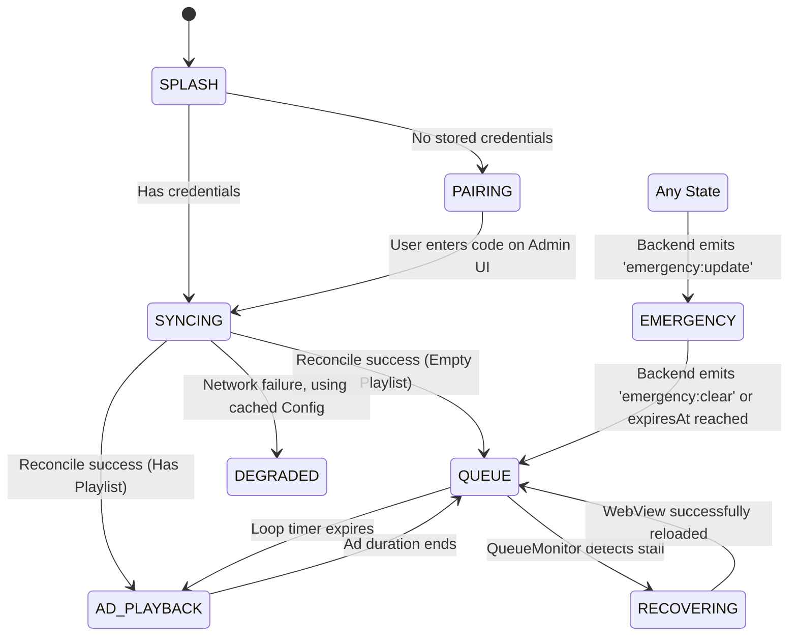
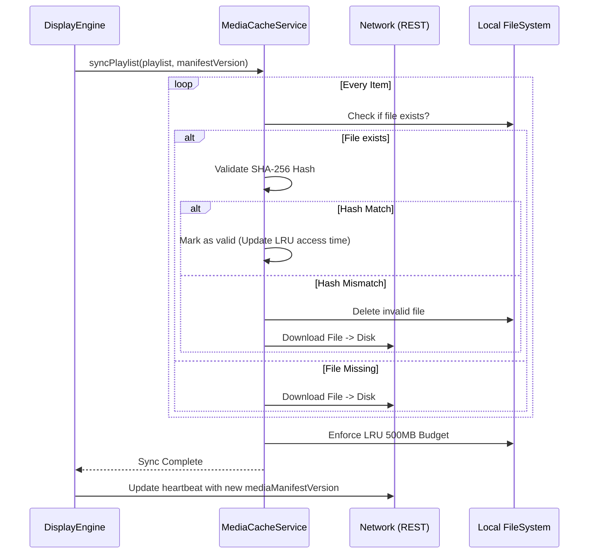
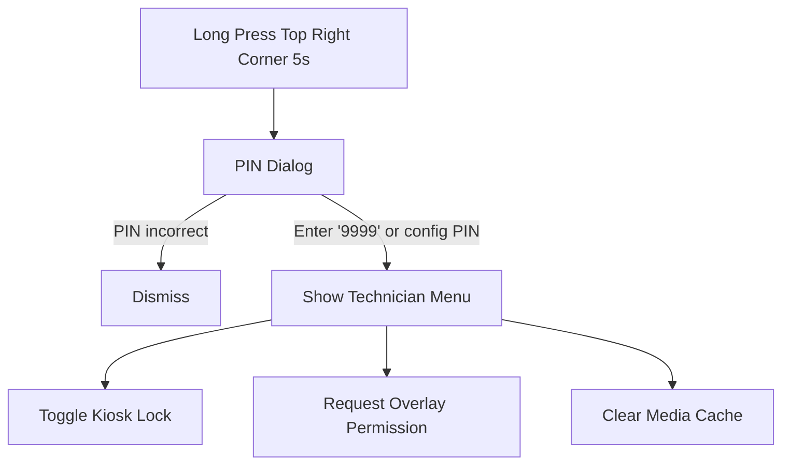

# TV Player Flow & Architecture

## Purpose & Responsibilities
The JJM TV Player is a Flutter application designed strictly for Android TV hardware. It functions as an unattended digital signage kiosk. Its responsibilities include:
- Auto-starting on TV boot (BootReceiver) and locking out standard Android UI (Kiosk mode).
- Rendering web-based queue URLs beneath Flutter UI overlays (videos, images, announcements).
- Pairing securely with the backend via 6-digit codes.
- Caching media locally for offline resiliency using SHA-256 validation.
- Recovering gracefully from network loss, queue stalls (MutationObserver polling), and API errors.
- Reporting exact diagnostic states (Heartbeats, Snapshots, Command Acks) back to the server.

## Tech Stack & Folder Tree
**Stack:** Flutter (Dart), `webview_flutter` (for the queue), `video_player`, `audioplayers` (siren generation), `socket_io_client`, `path_provider`, Android Kotlin (for BootReceiver & MethodChannels).

```text
JJM_TV_player/
├── android/
│   ├── app/src/main/kotlin/com/jjm/tv/
│   │   ├── MainActivity.kt        # Implements MethodChannel for System Overlays
│   │   └── BootReceiver.kt        # Intercepts boot events, reads kioskLock from SharedPreferences
├── lib/
│   ├── core/
│   │   ├── config/                # Environment variables parsing
│   │   ├── native/                # MethodChannel wrappers (KioskChannel.dart)
│   │   ├── network/               # API service (REST calls, interceptors)
│   │   ├── queue/                 # QueueMonitor (Javascript DOM polling logic)
│   │   ├── storage/               # SharedPreferences for caching offline configs
│   │   ├── sync/                  # MediaCacheService (LRU budget, downloads, SHA-256)
│   │   └── websocket/             # SocketService (Socket.IO event handlers)
│   ├── models/                    # Data classes (PlaylistItem, ResolvedConfig)
│   ├── screens/
│   │   ├── display/               # Main kiosk UI Engine (display_engine.dart)
│   │   ├── pairing/               # 6-digit PIN display UI
│   │   └── splash/                # Initial boot loading screen
│   └── main.dart                  # Flutter entry point (wakelock init, cache init)
└── assets/audio/                  # Generated siren.wav file
```

## Setup & Run

### Environment Variables
Currently, standard configuration is defined internally via the UI pairing process, but the backend URL is hardcoded during compilation or set dynamically via an admin debug dialog.

### Build & Deploy
- **Analyze**: `flutter analyze`
- **Build APK**: `flutter build apk --release` (Generates a FAT APK compatible with Android TV architectures).
- **Deployment**: Install via USB drive to Android TV or push via MDM.
- **Bootloader**: Upon first launch, accept the "Draw over other apps" permission by entering the Technician Menu (long press top-right for 5s, enter PIN `9999`).

## Working Flow Diagrams

### Boot Sequence & FSM State Diagram


### Media Sync & Caching Flow


### Technician Menu Flow (Hidden Kiosk Override)


## Error Handling & Security Notes
- **Authentication**: Stores `X-Device-Token` securely in SharedPreferences. On `401 Unauthorized` responses from the backend API, the device wipes its token and gracefully downgrades to the PAIRING screen.
- **Offline Resiliency**: If REST calls fail during boot, the system relies on `flutter.cached_display_config` generated during the last successful ping. Ad media falls back to `file://` URIs natively avoiding black screens.
- **Queue WebView Freeze**: A JS script is injected into the WebView. `QueueMonitor` polls `window.lastMutation`. If frozen > thresholds, it initiates an exponential backoff reload (to avoid flooding the hospital's patient software).
- **Snapshot Limitations**: Android `RepaintBoundary` cannot capture standard native WebViews. The snapshot logic explicitly transmits `source='queue-webview-uncaptured'` vs `flutter-layer` back to the server so admins know they are seeing a truthful approximation of the UI.

## Troubleshooting

| Symptom | Cause | Fix |
|---------|-------|-----|
| Stuck on Pairing Screen | Device token was revoked server-side, or the TV lost internet access before completing the pairing lifecycle. | Re-enter the pairing code on the Admin Website. |
| Emergency overlay doesn't appear | The target IDs for the emergency don't match this screen/department, OR the duration expired. | Create a 'Global' emergency or verify screen assignment. |
| Media shows briefly as black | The cached file was deleted externally or failed a checksum test dynamically right before render. | Automatically recovers next loop. Admin can hit "Clear Cache" remotely to force a flush. |
| App minimizes unexpectedly | Android TV OS reclaimed memory or killed the app. | If Kiosk Lock is enabled via Technician Menu, `BootReceiver` attempts to aggressively relaunch the app. |

## Manual QA Checklist (TV Player)
- [ ] Connect Android TV to internet. Open app, verify 6-digit pairing code appears.
- [ ] Pair via Admin UI. Verify TV immediately transitions to the Queue URL defined in its Department.
- [ ] Unplug ethernet. Verify TV continues playing cached images/videos in a loop flawlessly without crashing.
- [ ] Re-plug ethernet. Wait 20 seconds. Send an Emergency Broadcast from Admin UI. Verify Siren audio plays and red overlay takes over.
- [ ] Long-press top right corner for 5 seconds. Verify Technician Menu opens with correct PIN. Use menu to grant overlay permissions.
