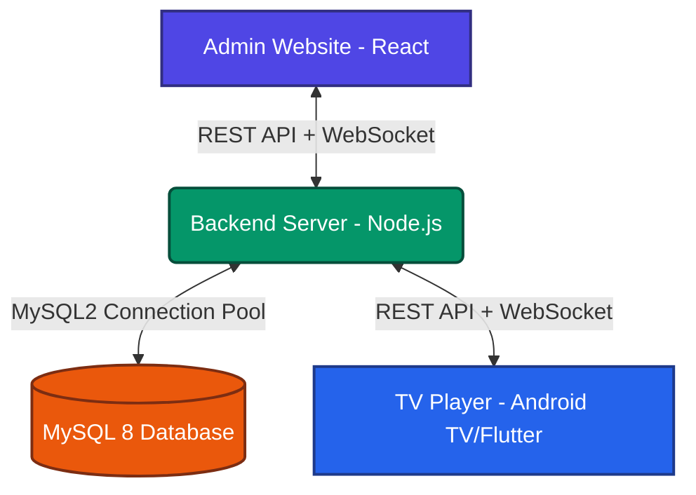
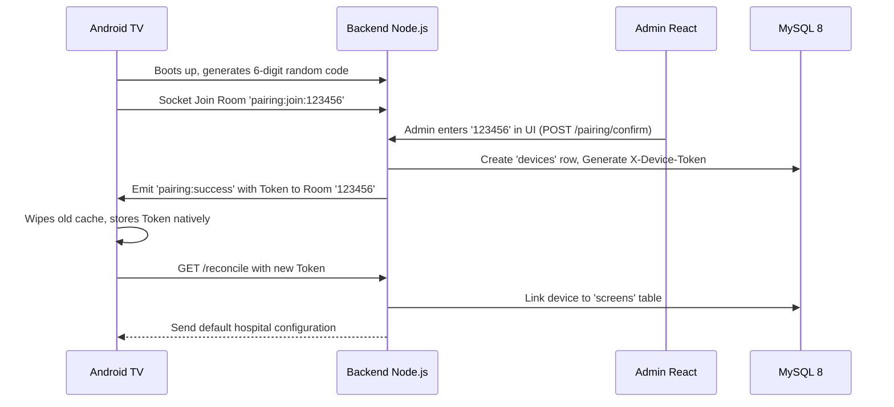
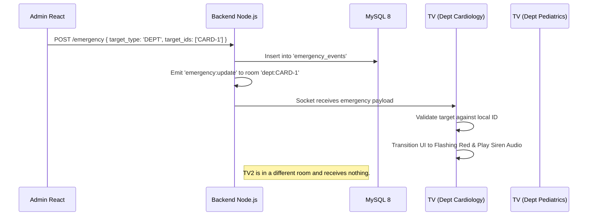

# System Architecture & Flow

This document provides a high-level overview of how the Admin Website, Backend API, and Android TV Player interact across the JJM Digital Signage Network.

## The Tri-Stack Architecture

## Global Concepts

### 1. Database & Persistence (MySQL 8)
- The entire system is anchored to a raw MySQL 8 database. 
- There are no intermediary ORMs masking performance, no local SQLite databases bridging gaps, and no Docker abstraction layers. 
- The backend handles automatic schema migrations natively on boot using raw `.sql` files.
- The `hospital_signage` database is the sole source of truth for campaigns, device pairings, administrative telemetry, and emergency declarations.

### 2. Live Synchronization (WebSockets)
WebSockets are heavily employed to ensure physical TVs update visually within milliseconds of an administrator's command:
- **`config:update`**: Emitted whenever a playlist, campaign, or device setting changes. Tells TVs to re-fetch their JSON payload.
- **`emergency:update`**: Overrides whatever is on the screen with a red flashing siren. Includes `expiresAt` limits mapped to the server's authoritative clock.
- **`command:new`**: Used for manual tasks like `TAKE_SNAPSHOT` or `SYNC_MEDIA`. Executes a complex 5-stage lifecycle (`CREATED` -> `SENT` -> `RECEIVED` -> `APPLIED` -> `ACKNOWLEDGED`).

### 3. Media Integrity (SHA-256)
All images and videos uploaded to the backend generate a SHA-256 hash. When a TV encounters a media file in its assigned config:
1. It looks at the local Android file system.
2. It hashes the file locally and compares it to the server's hash.
3. If valid, it plays completely offline without eating network bandwidth. If invalid, it deletes the file and downloads a fresh copy.

### 4. Resiliency & Diagnostics
- **Queue WebView Polling**: The Flutter app injects JavaScript into the hospital's live patient queue URL. It checks `window.lastMutation` every 10 seconds. If the page freezes but the network remains alive, Flutter performs a localized exponential-backoff reload, hiding this stutter behind cached advertisements.
- **CCTV Snapshots**: The TV leverages a Dart `image` parser to honestly scrape its own internal UI layers, converting them to compressed JPEGs (q60, <640px) which are streamed strictly when a Dashboard admin is connected to a `snapshot:watch` socket.
- **Heartbeats**: Every 20 seconds, the TV reports its config version, media sync status, and screen label. A Node.js CRON job purges silent screens, moving them to an `OFFLINE` status dynamically.

## Cross-Layer Flow Examples

### Pairing a New TV

### Emergency Alert Trigger

