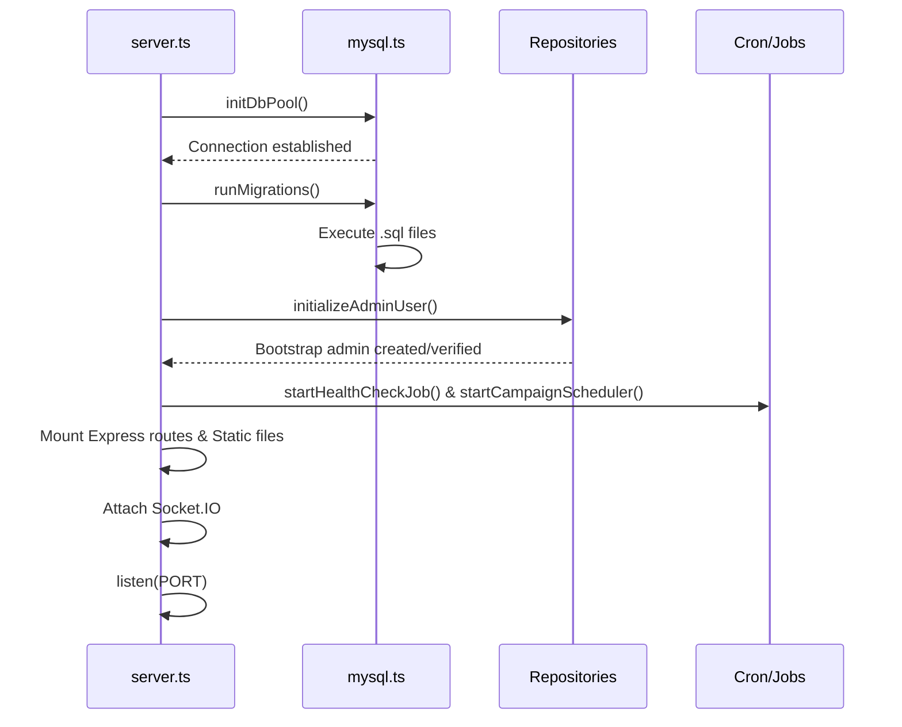
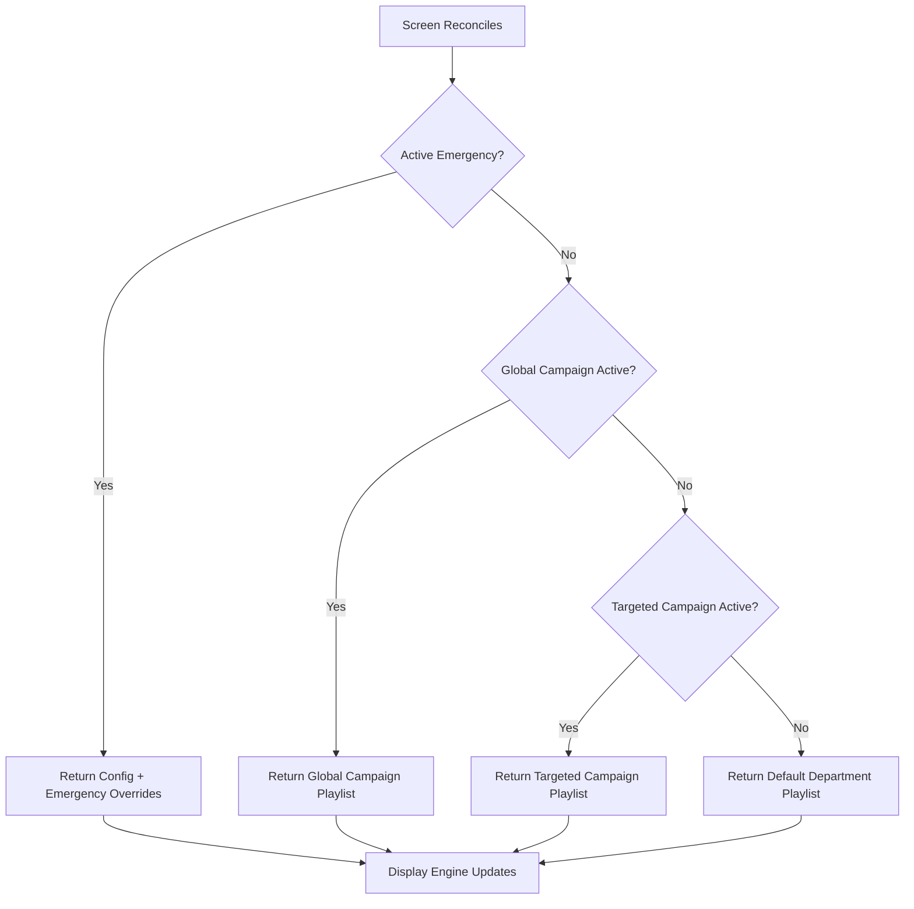
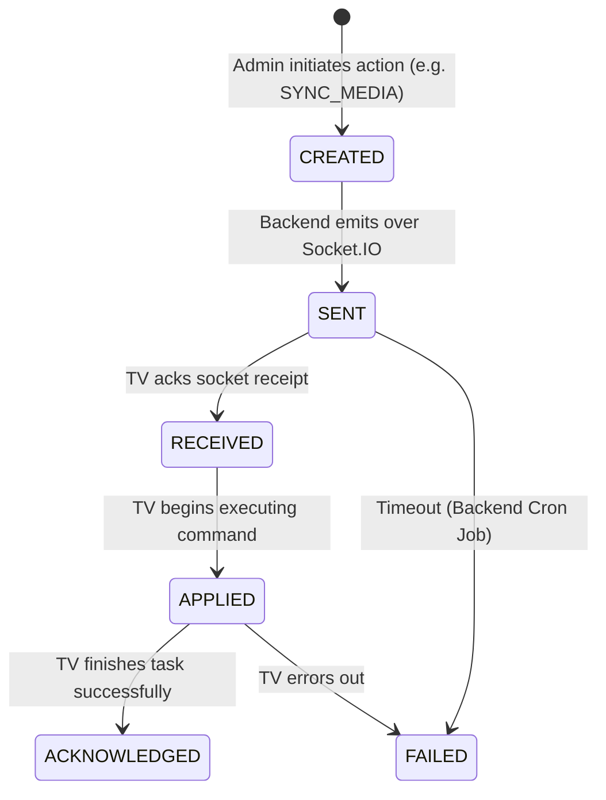
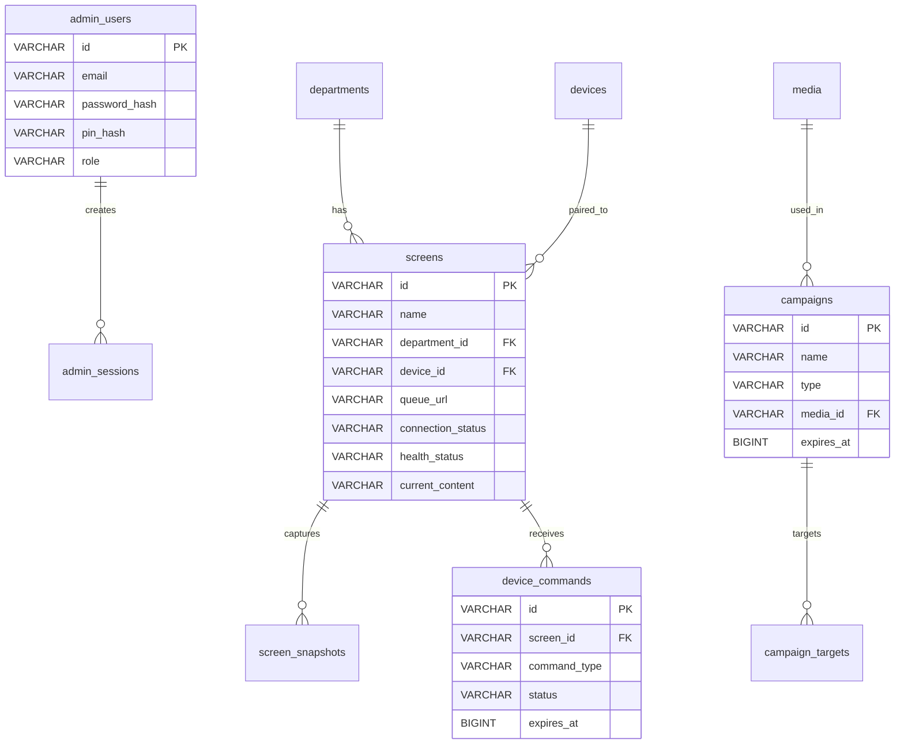

# Backend Flow & Architecture

## Purpose & Responsibilities
The Node.js (Express/Socket.IO) backend serves as the authoritative source of truth for the digital signage network. Its primary responsibilities include:
- Managing MySQL connections, automatic schema migrations, and admin bootstrapping on boot.
- Coordinating API requests from the Admin Website (React) and the TV Player (Flutter).
- Emitting real-time updates (commands, config changes, emergency alerts) over WebSockets to targeted screens.
- Resolving campaign scheduling and config prioritization dynamically.
- Managing media uploads, serving local static assets, and persisting configuration to MySQL.

## Tech Stack & Folder Tree
**Stack:** Node.js, Express, Socket.IO, MySQL2 (pure SQL, no ORM), JSON Web Tokens (custom hashing), node-cron.

```text
backend/
├── src/
│   ├── api/                   # Express routes (REST endpoints)
│   │   ├── admin/             # Admin-facing endpoints (auth, campaigns, media, screens)
│   │   └── display/           # TV-facing endpoints (reconcile, commands)
│   ├── config/                # Environment variables parsing and setup
│   ├── db/                    # MySQL database logic
│   │   ├── migrations/        # Raw .sql migration files
│   │   ├── mysql.ts           # DB connection pool, transaction logic, migration runner
│   │   └── repositories/      # SQL query wrappers (screens, campaigns, emergency, etc.)
│   ├── jobs/                  # node-cron scheduled tasks (health check, campaign expiry)
│   ├── models/                # TypeScript interfaces
│   ├── services/              # Business logic (auth, config resolution, file uploads)
│   ├── websocket/             # Socket.IO handlers
│   │   ├── socketMap.ts       # Room and connection tracking
│   │   ├── adminHandler.ts    # Events emitted/listened to by admin dashboard
│   │   └── displayHandler.ts  # Events emitted/listened to by TV players
│   └── server.ts              # Entry point: DB connect -> Migrate -> Boot Express/Sockets
├── .env.example               # Template for environment variables
└── package.json               # Dependencies (mysql2, express, socket.io, etc.)
```

## Setup & Run

### Environment Variables
| Name | Required | Meaning | Example Value |
|------|----------|---------|---------------|
| `PORT` | No | Server port | `5000` |
| `NODE_ENV` | No | Environment (dev/prod) | `development` |
| `CORS_ORIGIN` | No | Allowed Origins | `*` |
| `PUBLIC_URL` | No | URL to access static assets | `http://localhost:5000` |
| `UPLOAD_DIR` | No | Path to store media | `./uploads` |
| `DB_HOST` | **Yes** | MySQL server address | `localhost` |
| `DB_PORT` | **Yes** | MySQL server port | `3306` |
| `DB_USER` | **Yes** | MySQL database user | `CHANGE_ME` |
| `DB_PASSWORD` | **Yes** | MySQL database password | `CHANGE_ME` |
| `DB_NAME` | **Yes** | MySQL database name | `hospital_signage` |
| `DB_POOL_SIZE`| No | Max concurrent DB connections | `10` |
| `ADMIN_EMAIL` | **Yes** | Bootstrap admin email | `admin@hospital.local` |
| `ADMIN_PASSWORD`| **Yes** | Bootstrap admin password | `CHANGE_ME` |
| `ADMIN_PIN` | **Yes** | Bootstrap admin PIN | `9999` |

### Local Development
1. Clone the repo and `cd backend`.
2. `npm install`
3. Copy `.env.example` to `.env` and fill in DB credentials.
4. Ensure MySQL 8 is running locally.
5. Run `npm run dev`. The server will automatically connect to MySQL, run `001_init.sql`, inject the bootstrap admin, and start on port 5000.

### Build & Deploy
- **Build**: `npm run build` transpiles `src/` to `dist/`.
- **Deploy (Render/VPS)**: Set standard environment variables (DB credentials, Render public URL). Use `npm start` (runs `node dist/server.js`). Provide a persistent disk for `UPLOAD_DIR` if you are hosting files locally, or rely on S3 (requires modifying fileUpload.ts).

## Working Flow Diagrams

### Boot Sequence


### Config Resolution Priority


### Command Lifecycle (5-Stage)


### Socket Room Map
| Client | Room Name | Events Emitted by Backend | Events Listened by Backend |
|--------|-----------|---------------------------|----------------------------|
| Admin | `admin:dashboard` | `screen:status`, `snapshot:new` | `snapshot:watch` |
| Admin | `pairing:join:<CODE>` | `pairing:success`, `pairing:fail` | N/A |
| TV | `screen:<SCREEN_ID>` | `config:update`, `command:new`, `emergency:update`, `snapshot:request` | `screen:heartbeat`, `screen:snapshot`, `command:*` |
| TV | `dept:<DEPT_ID>` | `config:update` (dept level), `emergency:update` (dept level) | N/A |
| TV | `pairing:join:<CODE>` | `pairing:success`, `pairing:fail` | N/A |

## API & Socket Reference

### REST API Examples
**Admin Login:**
`POST /api/admin/auth/login`
```json
// Request
{ "email": "admin@hospital.local", "password": "CHANGE_ME" }
// Response
{ "token": "<TOKEN>", "user": { "role": "admin" } }
```

**TV Reconcile:**
`GET /api/display/<SCREEN_ID>/reconcile?configVersion=2&manifestVersion=2`
```json
// Headers: X-Device-Token: <TOKEN>
// Response
{
  "config": {
    "screenId": "<SCREEN_ID>",
    "queueUrl": "https://queue.hospital.local/dept/1",
    "configVersion": 3,
    "mediaManifestVersion": 2,
    "playlist": [...],
    "settings": { "powerState": "on", "isPaused": false }
  },
  "activeEmergency": null,
  "pendingCommands": []
}
```

## Data Model (MySQL)


## Error Handling & Security Notes
- **Authentication**: Devices use a long-lived `X-Device-Token` generated at pairing. Admins use standard JWTs via `Authorization: Bearer`.
- **Authorization**: Role-based. All mutating endpoints ensure the user is active.
- **SQL Injection**: Prevented globally by strictly using `mysql2/promises` parameterized queries (`?`). NEVER concatenate strings into SQL queries.
- **Data Validation**: Express routes validate incoming body parameters. Default fallbacks (e.g. `180` seconds) exist for thresholds.
- **File Uploads**: `multer` checks file size (max 500MB) and mimetypes (JPEG, PNG, MP4). Corrupt files are handled by frontend SHA-256 validation.

## Troubleshooting

| Symptom | Cause | Fix |
|---------|-------|-----|
| Backend crash on boot `ECONNREFUSED` | MySQL is not running or credentials in `.env` are wrong. | Start MySQL, verify `DB_USER` and `DB_PASSWORD`. |
| TVs showing 'Unauthorized' (401/403) | TV's `device_token` was rotated or deleted from the database. | The TV will auto-show a 6-digit pairing code. Re-pair from the Admin UI. |
| Media uploads fail | File exceeds size limits or `UPLOAD_DIR` lacks write permissions. | `chmod -R 755 uploads/` or increase reverse-proxy size limits (e.g., Nginx `client_max_body_size`). |
| Commands stuck in `SENT` state | The TV is disconnected or the socket dropped without a clean HTTP fallback. | Wait 3 minutes; the backend cron job will mark it `FAILED`. Force a page refresh on the TV if necessary. |

## Manual QA Checklist (Backend)
- [ ] Ensure `.env` is loaded cleanly.
- [ ] Start server. Check logs for `[DB] Connected` and `[DB] Migrations applied`.
- [ ] Hit `/api/admin/auth/login` with correct credentials via Postman/Admin UI, get 200 OK + token.
- [ ] Pair a new screen via `/api/admin/screens/pairing/confirm`. Verify `devices` and `screens` tables are updated.
- [ ] Upload an image to `/api/admin/media/upload`. Verify SHA-256 hash in `media` table matches file.
- [ ] Create an emergency broadcast. Verify `emergency_events` table inserts a record, and Sockets emit to targeted rooms.
- [ ] Let 5 minutes pass. Verify `HealthCheckJob` runs and marks disconnected screens as `offline`.
